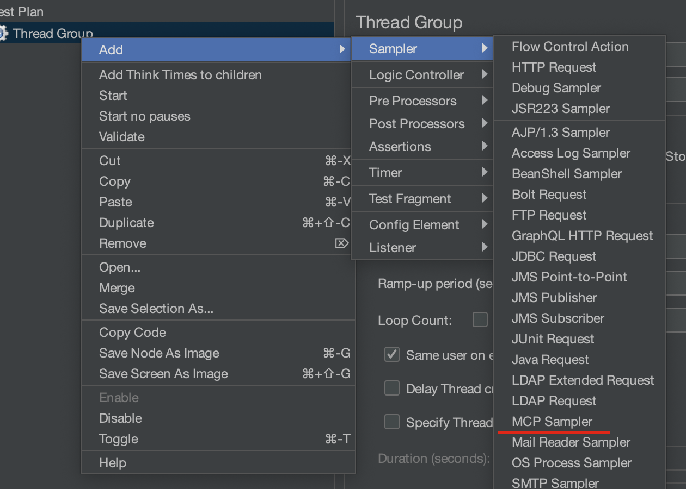
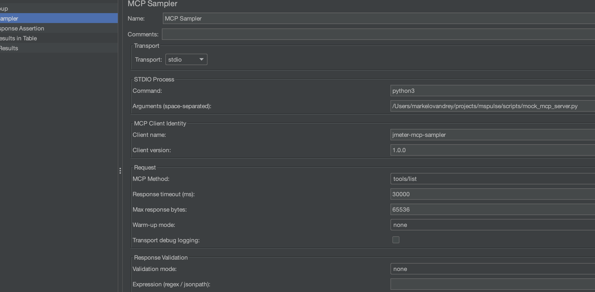
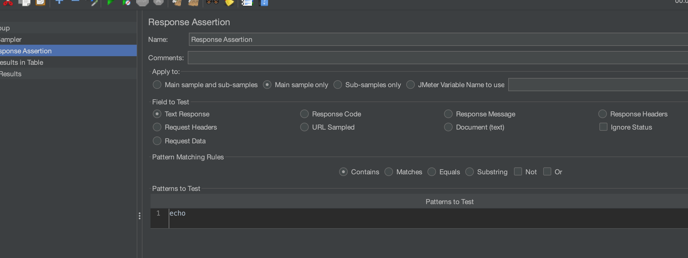
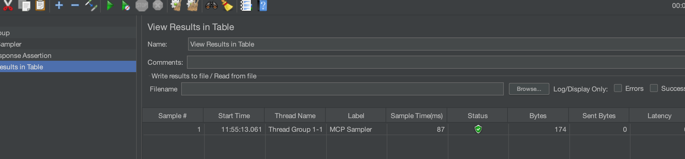
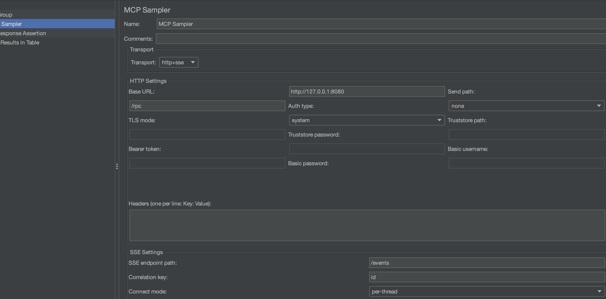
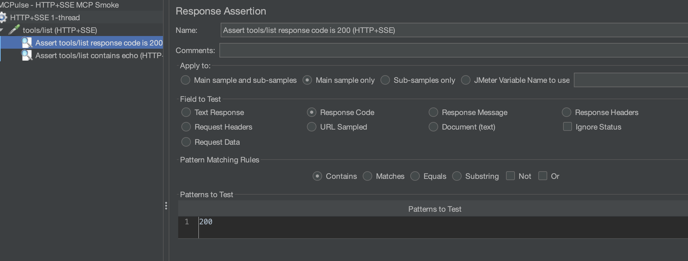

# MCPulse - JMeter MCP Sampler
[](https://github.com/AndreyVMarkelov/MCPulse/actions/workflows/ci.yml?query=branch%3Amain)

Load-test MCP (Model Context Protocol) servers over stdio, HTTP, and HTTP+SSE directly from Apache JMeter.

## Compatibility

| Component | Version |
|---|---|
| Java | 11+ |
| Apache JMeter | 5.6.3 (current project baseline) |
| Gradle Wrapper | 8.10.2 |

## Installation

This project now builds a **thin plugin jar**:

- plugin jar goes to `JMETER_HOME/lib/ext`
- runtime dependencies go to `JMETER_HOME/lib`

### Recommended local install (plugin + dependencies)

```bash
JMETER_HOME=/path/to/apache-jmeter-5.6.3 ./gradlew installLocalWithDeps
```

### Plugin-only local install

Use this only if dependencies are already managed elsewhere.

```bash
JMETER_HOME=/path/to/apache-jmeter-5.6.3 ./gradlew installLocal
```

### Build artifact

```bash
./gradlew jar
```

Jar path:

`build/libs/jmeter-mcp-sampler-<version>.jar`

### Plugins Manager Custom Repo (Latest Release)

Each tagged release now publishes a Plugins Manager descriptor asset:

`https://github.com/AndreyVMarkelov/MCPulse/releases/latest/download/plugins-repo.json`

To add this custom repo in JMeter, set in `user.properties`:

```properties
jpgc.repo.address=https://jmeter-plugins.org/repo/;https://github.com/AndreyVMarkelov/MCPulse/releases/latest/download/plugins-repo.json
```

Then restart JMeter and open Plugins Manager.

## Quick Start (2 Minutes)

Path note: commands and `scripts/...` arguments below are relative to this repository root.  
Run JMeter from the repo root, or use absolute paths.

1. Install plugin (see `Installation > Recommended local install` above).
2. Restart JMeter.
3. Add sampler: `Thread Group -> Add -> Sampler -> MCP Sampler`.



4. Use local echo mock (stdio) with these sampler settings:
   - `Transport`: `stdio`
   - `Command`: `python3`
   - `Arguments`: `scripts/mock_mcp_server.py`
   - `MCP Method`: `tools/list`
   - `Client name`: `jmeter-mcp-sampler` (default)
   - `Client version`: `1.0.0` (default)



5. Add a Response Assertion:
   - `Field to Test`: `Response Data`
   - `Pattern`: `echo`



6. Run test and verify the assertion passes.



### HTTP + SSE Quick Start

1. Start local mock HTTP+SSE server:

```bash
node scripts/mock_http_sse_mcp_server.js
```

2. In sampler set:
- `Transport`: `http+sse`
- `HTTP base URL`: `http://127.0.0.1:8080`
- `SSE endpoint path`: `/events`
- `HTTP send path`: `/rpc`
- `MCP Method`: `tools/list`
- `Validation mode`: `none` (when using JMeter `Response Assertion`)



3. Add Response Assertion for HTTP status:
- `Field to Test`: `Response Code`
- `Pattern`: `200`



4. Run test and verify the assertion passes (`Response Code = 200`, sample is green).

Alternative: use built-in sampler validation instead of JMeter assertions:
- `Validation mode`: `regex`
- `Validation expr`: `echo`

## GUI Configuration

| Field | Description | Example |
|---|---|---|
| Transport | `stdio`, `http`, `http+sse` | `http+sse` |
| Command | Executable to run | `python3`, `node`, `uvx` |
| Arguments | Space-separated args passed to command | `scripts/mock_mcp_server.py` |
| HTTP base URL | Target MCP gateway/server URL | `http://127.0.0.1:8080` |
| HTTP send path | JSON-RPC POST endpoint | `/rpc` |
| SSE endpoint path | SSE stream endpoint (HTTP+SSE mode) | `/events` |
| SSE connect mode | `per-sample` or `per-thread` | `per-thread` |
| Correlation key | Field used to match SSE responses | `id` |
| Headers | Multi-line `Key: Value` | `Authorization: Bearer ...` |
| Client name | Sent in `initialize` | `jmeter-mcp-sampler` |
| Client version | Sent in `initialize` | `1.0.0` |
| Response timeout (ms) | Per-request timeout | `30000` |
| Max response bytes | Trim response payload in sample data | `65536` |
| Validation mode | `none`, `regex`, `jsonpath`, `equals` | `jsonpath` |
| Warm-up mode | `none`, `process`, `initialize` | `initialize` |
| MCP Method | JSON-RPC method family | `tools/list` |
| Raw request JSON | Full JSON-RPC template for `raw JSON` method | `{\"jsonrpc\":\"2.0\",\"method\":\"tools/list\"}` |
| Tool name | Used by `tools/call` | `echo` |
| Arguments (JSON) | Tool arguments for `tools/call` | `{"message":"hello","count":2}` |

Screenshot guide and catalog: [docs/images/README.md](docs/images/README.md)

## Supported MCP Methods

| Sampler method | Sent JSON-RPC |
|---|---|
| `initialize` | `initialize` (and `notifications/initialized` only when initialize succeeds) |
| `tools/list` | `tools/list` |
| `tools/call` | `tools/call` |
| `resources/list` | `resources/list` |
| `raw JSON` | user-provided JSON-RPC payload |

## Test MCP Servers

### Local mock servers in this repo

#### 1) Python echo server

File: `scripts/mock_mcp_server.py`

Start manually:

```bash
python3 scripts/mock_mcp_server.py
```

Behavior:

- `initialize` returns server `mock-mcp-server`.
- `tools/list` exposes one tool: `echo`.
- `tools/call` with tool `echo` echoes arguments back and returns `content`.
- `resources/list` returns one in-memory resource.
- unknown tool returns JSON-RPC error `-32602`.

Useful `tools/call` sample:

```json
{"message":"hello","count":2}
```

Expected response includes:

- `content[0].text` like `echo: hello (count=2)`
- `echo.message = "hello"`

#### 2) Node calc server

File: `scripts/mock_calc_mcp_server.js`

Start manually:

```bash
node scripts/mock_calc_mcp_server.js
```

Behavior:

- `initialize` returns server `mock-calc-mcp-server-ts`.
- `tools/list` exposes tools `add` and `divide`.
- `tools/call` validates numeric `a` and `b`.
- divide by zero returns error `-32000`.
- unknown tool returns error `-32602`.

Useful `tools/call` samples:

```json
{"a":40,"b":2}
```

```json
{"a":10,"b":0}
```

Expected:

- `add` returns numeric `value` (`42` for sample above).
- `divide` with `b=0` returns error `Division by zero`.

#### 3) Python perf server

File: `scripts/mock_perf_mcp_server.py`

Start manually:

```bash
python3 scripts/mock_perf_mcp_server.py --base-delay-ms 5 --jitter-ms 10 --slow-every 20 --slow-delay-ms 200
```

Behavior:

- `tools/list` exposes `sleep`, `payload`, `cpu`.
- `sleep` tool supports controlled delay.
- `payload` tool returns a large blob for payload-pressure testing.
- `cpu` tool burns CPU loops and returns accumulator.

Useful `tools/call` payload samples:

```json
{"delayMs":50}
```

```json
{"sizeKb":256}
```

```json
{"loops":300000}
```

#### 4) Node HTTP + SSE server

File: `scripts/mock_http_sse_mcp_server.js`

Start manually:

```bash
node scripts/mock_http_sse_mcp_server.js
```

Behavior:

- SSE endpoint: `/events`
- JSON-RPC send endpoints: `/rpc` and `/message`
- supports `initialize`, `tools/list`, `tools/call`, `resources/list`
- sends JSON-RPC response via HTTP body and broadcasts same response over SSE

### External servers often used with this sampler

`mcp-server-fetch` (via `uvx`):

```text
Command:   uvx
Arguments: mcp-server-fetch
```

`mcp-server-filesystem`:

```text
Command:   uvx
Arguments: mcp-server-filesystem /tmp
```

`github-mcp-server`:

```text
Command:   github-mcp-server
Arguments: stdio
```

Requires `GITHUB_PERSONAL_ACCESS_TOKEN`.

## Docker Scenarios

Each profile builds image, runs a test plan, writes JTL + HTML report to `results/`.

```bash
docker compose --profile mock-echo up --build
docker compose --profile mock-calc up --build
docker compose --profile perf-cold-start up --build
docker compose --profile perf-tail up --build
docker compose --profile perf-payload up --build
```

Reports:

- `results/docker-mock-echo/report/index.html`
- `results/docker-mock-calc/report/index.html`
- `results/docker-perf-cold-start/report/index.html`
- `results/docker-perf-tail/report/index.html`
- `results/docker-perf-payload/report/index.html`

## Gradle Task Shortcuts

```bash
./gradlew test
./gradlew check
JMETER_HOME=/path/to/apache-jmeter-5.6.3 ./gradlew installLocalWithDeps
JMETER_HOME=/path/to/apache-jmeter-5.6.3 ./gradlew mockAll
JMETER_HOME=/path/to/apache-jmeter-5.6.3 ./gradlew perfAll
```

## CI and Release

Additional CI/release details are documented separately.

- CI details: [docs/CI.md](docs/CI.md)
- Release and publishing details: [docs/RELEASE.md](docs/RELEASE.md)

## Troubleshooting

`Results file ... is not empty` in Docker:

- fixed in current entrypoint by cleaning stale `results.jtl` before run.

`JMETER_HOME is not set`:

- run Gradle tasks with `JMETER_HOME=/path/to/apache-jmeter-5.6.3`.

No sampler appears in JMeter:

- verify plugin jar is in `lib/ext`
- verify runtime dependency jars are in `lib`
- restart JMeter

## License

MIT
